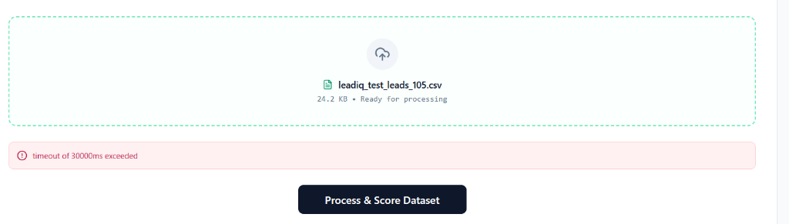
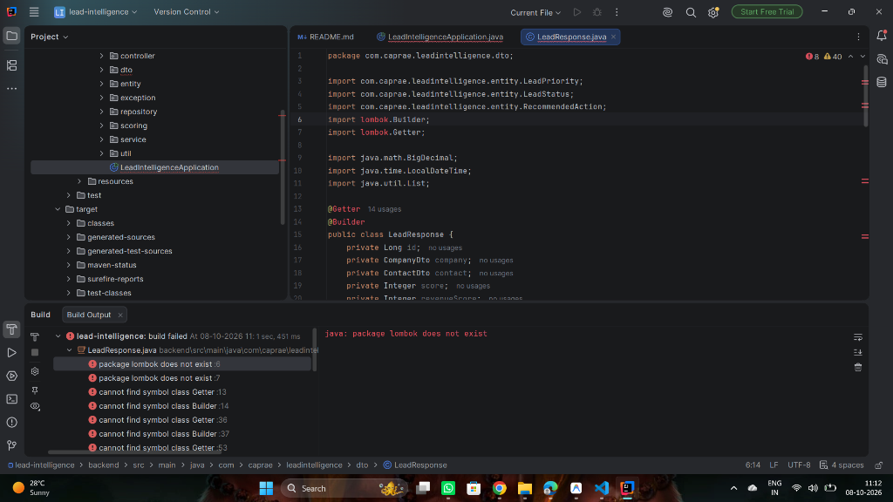
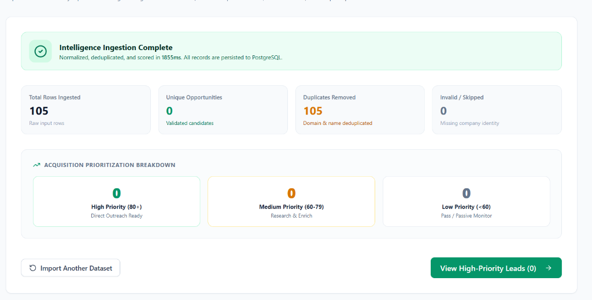
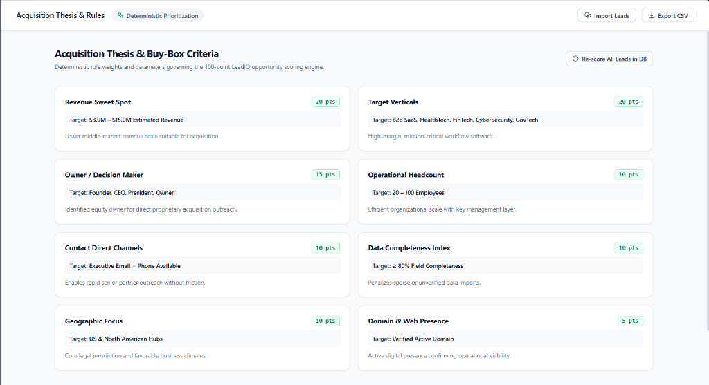

# LeadIQ — AI Lead Intelligence & Prioritization Platform

> **"Lead generation creates data. Lead intelligence creates decisions."**

LeadIQ is a full-stack acquisition intelligence platform that transforms raw business lead datasets into ranked, explainable acquisition opportunities.

Instead of asking:
> *"Who can I contact?"*

LeadIQ answers:
> **"Who should I contact first, why do they fit our acquisition thesis, and what should I do next?"**

Built for the **Caprae Capital Full Stack Developer Challenge**.

---

## Product Preview

### Executive Dashboard


### Prioritized Opportunities Directory


### CSV Intelligence Ingestion & Pipeline


### Acquisition Buy Box & Scoring Breakdown


---

## Problem

Lead-generation platforms produce thousands of potential company records, but acquisition teams cannot manually evaluate every lead.

The operational bottleneck moves from discovery to prioritization:

```text
Raw Lead Dataset ──► Manual Screening (Slow, High Friction) ──► 5% Ideal Candidates
```

For an acquisition professional, the key question is not simply:
> *"Can we find more leads?"*

It is:
> **"Which companies deserve attention first, and why?"**

---

## Why I Did Not Rebuild the Scraping Layer

Lead-generation tools already address basic web discovery. Within the 5-hour challenge constraint, building another generic web scraper would provide limited incremental value.

Instead, LeadIQ focuses on the critical decision layer that follows discovery:
- Normalizing messy firmographic headers & values
- Purging duplicate entities (intra-file and pre-existing DB matches)
- Scoring acquisition fit deterministically against a 100-point buy box
- Explaining score drivers transparently
- Recommending deterministic next best actions (`CALL`, `EMAIL`, `RESEARCH`, `VERIFY`, `SKIP`)
- Generating AI qualitative acquisition theses and executive outreach angles

This makes LeadIQ complementary to existing lead-generation tools rather than another scraping script.

---

## Solution

LeadIQ converts raw lead data into actionable acquisition intelligence.

For every ingested company, the platform provides:
- A deterministic 0–100 acquisition score
- Transparent score audit breakdowns
- Tiered priority classification (`HIGH`, `MEDIUM`, `LOW`)
- An actionable directive (`CALL`, `EMAIL`, `RESEARCH`, `VERIFY`, `SKIP`)
- Profile completeness & contact availability indicators
- Google Gemini-powered qualitative investment insights & outreach strategy
- Streamed CSV export for CRM or dialer integration

---

## Key Features

| Feature | What It Does |
|---|---|
| **CSV Intelligence Ingestion** | Ingests raw CSV lead files and normalizes loose header variations |
| **Data Quality & Hygiene** | Parses revenue multipliers (`$8.2M`, `$500K`), normalizes domains, and validates emails |
| **Entity Deduplication** | Purges intra-file duplicates and identifies pre-existing PostgreSQL database matches |
| **Deterministic Buy Box** | Scores acquisition fit from 0–100 across 8 weighted criteria |
| **Explainable Audit Trail** | Surfaces transparent bullet reasons for why points were awarded or docked |
| **Priority Classification** | Tiers leads into High (80+), Medium (60–79), and Low (<60) priority buckets |
| **Next Best Action Engine** | Directs analysts to `CALL`, `EMAIL`, `RESEARCH`, `VERIFY`, or `SKIP` |
| **Google Gemini AI Insights** | Synthesizes executive deal summaries and personalized outreach angles |
| **Offline Fallback Engine** | Ensures core prioritization remains available when external AI services are unavailable |
| **Executive Dashboard** | Displays portfolio KPIs, priority donuts, and score distribution charts |
| **Lead Directory & Modal** | Offers search, filtering, status tracking, and full lead dossiers |
| **Prioritized CSV Export** | Exports ranked, filtered opportunities for downstream outreach |

---

## Acquisition Scoring

LeadIQ uses a deterministic 100-point acquisition buy box:

| Criterion | Max Points | Evaluation Focus |
|---|---:|---|
| **Revenue Fit** | 20 | Target sweet spot ($3M – $15M estimated revenue) |
| **Industry Fit** | 20 | Primary software/SaaS verticals vs. lower-margin agencies/services |
| **Decision Maker Authority** | 15 | Direct owners/CEOs (15 pts) vs C-Suite (10 pts) vs VPs/Directors (3 pts) |
| **Geography Fit** | 10 | Tier-1 tech hubs (10 pts) vs secondary markets (5 pts) |
| **Headcount Scale** | 10 | Scalable team size (20–100 employees) |
| **Contact Availability** | 10 | Direct verified Email + Phone (10 pts) vs Email or Phone (5 pts) |
| **Data Quality** | 10 | Attribute profile completeness (0–10 pts) |
| **Website / Domain** | 5 | Active corporate domain verification |
| **Total** | **100** | |

### Priority Tiers
- **HIGH Priority (80–100)**: Direct outreach ready
- **MEDIUM Priority (60–79)**: Research & enrichment candidates
- **LOW Priority (<60)**: Below acquisition threshold / passive monitor

### Why Deterministic Scoring?
The primary ranking logic is intentionally deterministic and explainable. Private equity partners require reproducible, objective scoring criteria so they understand exactly why Company A ranked above Company B. 

Google Gemini AI is used exclusively for qualitative synthesis and outreach context, not numerical ranking.

---

## Example Import Benchmark Result

Testing with a 50-record benchmark dataset containing 40 unique leads and 10 intentional intra-file duplicates:

| Metric | Clean Database (Test 1) | Re-Upload Same CSV (Test 2) |
|---|---:|---:|
| **Input Rows** | 50 | 50 |
| **Valid Rows** | 50 | 50 |
| **New Opportunities** | 40 | 0 |
| **Existing Records Matched** | 0 | 40 |
| **Duplicates Removed** | 10 | 10 |
| **High Priority (80+)** | 24 | 24 |
| **Medium Priority (60–79)** | 12 | 12 |
| **Low Priority (<60)** | 4 | 4 |

> The priority distribution demonstrates that the scoring engine differentiates strong, moderate, and weak acquisition opportunities rather than assigning flat scores to every lead.

---

## Architecture

```text
                     Raw CSV Lead Dataset
                              │
                              ▼
                   ┌─────────────────────┐
                   │ Ingestion Pipeline  │
                   │ • Header Mapping    │
                   │ • Hygiene & Parse   │
                   │ • Entity Dedupe     │
                   └──────────┬──────────┘
                              ▼
                     Neon PostgreSQL DB
                              │
                              ▼
                   Deterministic Buy Box
                    (0 - 100 Audit Engine)
                              │
                    ┌─────────┴─────────┐
                    ▼                   ▼
           Next Best Action     Google Gemini AI
          (CALL/EMAIL/RESEARCH) (Qualitative Thesis)
                    │                   │
                    └─────────┬─────────┘
                              ▼
                     React 18 Dashboard
```

---

## Technology Stack

### Frontend
- React 18 & JSX
- Vite
- Tailwind CSS
- Lucide React (Icons)
- Recharts (Visualizations)
- React Router 6
- Axios

### Backend
- Java 17
- Spring Boot 3.2.4
- Spring Data JPA & Hibernate
- Apache Commons CSV
- Spring WebClient
- Jackson

### Database & AI
- PostgreSQL (Neon Cloud)
- Google Gemini API (`gemini-1.5-flash`)
- Deterministic Offline Fallback Engine

---

## Setup & Installation

### Prerequisites
- Java 17+
- Node.js 18+
- Maven 3.8+

### 1. Backend Setup
```bash
cd backend
./mvnw spring-boot:run
```
The backend server starts at `http://localhost:8080`.

### 2. Frontend Setup
```bash
cd frontend
npm install
npm run dev
```
The application frontend runs at `http://localhost:5173`.

---

## Environment Variables

Configured in `backend/src/main/resources/application.properties` (or via OS environment variables):

```env
# Database Configuration
DB_URL=jdbc:postgresql://localhost:5432/lead_intelligence
DB_USERNAME=postgres
DB_PASSWORD=your_password

# Gemini AI API Configuration
GEMINI_API_KEY=your_gemini_api_key
GEMINI_API_URL=https://generativelanguage.googleapis.com/v1beta/models
GEMINI_MODEL=gemini-1.5-flash

# CORS & App Settings
FRONTEND_URL=http://localhost:5173
```

---

## API Overview

| Method | Endpoint | Purpose |
|---|---|---|
| `GET` | `/api/dashboard/summary` | Fetches aggregated portfolio KPI metrics and chart distributions |
| `GET` | `/api/leads` | Queries paginated, sorted, and filtered leads directory |
| `GET` | `/api/leads/{id}` | Retrieves full dossier details for a single lead |
| `PUT` | `/api/leads/{id}/status` | Updates lead pipeline status (`NEW`, `REVIEWING`, `QUALIFIED`, etc.) |
| `DELETE` | `/api/leads/{id}` | Deletes a specific lead record |
| `DELETE` | `/api/leads/all` | Purges all records from PostgreSQL database |
| `POST` | `/api/import/csv` | Ingests CSV file through normalization, deduplication, scoring, and storage |
| `POST` | `/api/leads/{id}/score` | Recalculates score for an individual lead |
| `POST` | `/api/leads/score-all` | Re-evaluates scoring for all leads in database |
| `POST` | `/api/ai/leads/{id}/explanation` | Generates 2–3 sentence Gemini AI executive investment thesis |
| `POST` | `/api/ai/leads/{id}/outreach-angle` | Generates 2–4 sentence Gemini AI personalized outreach angle |
| `GET` | `/api/leads/export` | Streams filtered, prioritized leads directly to CSV |

---

## Testing

Execute the automated backend test suite:

```bash
cd backend
./mvnw test
```

The test suite includes 11 automated unit and integration tests covering:
- Deterministic 100-point buy box scoring logic (`ScoringEngineTest`)
- Domain and normalized name cross-entity deduplication (`DeduplicationServiceTest`)
- Data hygiene & revenue multiplier parsing
- Spring Boot application context bootstrapping (`LeadIntelligenceApplicationTests`)

---

## Tradeoffs Under the 5-Hour Constraint

### 1. Decision Intelligence over Scraping
Lead discovery is well-served by existing databases. Within 5 hours, building another basic web scraper would add minimal value compared to building the decision & prioritization engine that sits downstream of discovery.

### 2. Deterministic Scoring over Pure AI Ranking
Numerical scoring must be reproducible, transparent, and auditable. AI is reserved for qualitative synthesis (theses and outreach angles) rather than opaque numerical ranking.

### 3. Resilient Offline Fallback Architecture
Production acquisition tools should never break if external AI rate limits are exceeded or network connectivity drops. LeadIQ provides deterministic fallback reasoning when AI APIs are unavailable.

### 4. Authentication Deferred
User authentication was intentionally deferred to maximize development velocity on core pipeline hygiene, deduplication accuracy, buy-box scoring, and executive user experience.

---

## Success Criteria

LeadIQ succeeds if an acquisition analyst can:
1. Ingest a raw inbound CSV lead dataset.
2. Review automated data hygiene and deduplication metrics.
3. Instantly identify the highest-fit acquisition candidates.
4. Inspect transparent bullet points explaining why each score was awarded.
5. Know the exact next action to execute (`CALL`, `EMAIL`, `RESEARCH`, `VERIFY`, `SKIP`).
6. Leverage AI qualitative insights for owner outreach.
7. Export prioritized candidates to CRM or dialer.

---

## Future Improvements

- CRM sync integration (HubSpot / Salesforce APIs)
- Configurable buy-box rules engine UI
- Direct enrichment integration (Clearbit / ZoomInfo APIs)
- Automated AI acquisition memo generation
- Owner exit-readiness / intent signal modeling
- Async queue processing for 100k+ row datasets

---

## Ethical Data Use

LeadIQ is designed to process user-provided commercial B2B datasets. Production deployments should:
- Adhere to applicable data privacy regulations (GDPR, CCPA).
- Honor data provider licensing terms.
- Avoid unauthorized scraping or access-control bypasses.

---

## Demo Video

🎥 **Product Walkthrough Video**: [Watch LeadIQ Demo Video](https://drive.google.com/file/d/1oiSrlsrpHIVTIUbYij8dNV1oFAHPBNXQ/view?usp=sharing)

The demo highlights:
1. Executive KPI dashboard & score distribution charts
2. CSV intelligence ingestion pipeline & deduplication summary
3. Filtered prioritized leads directory
4. Deep-dive lead dossier with score audit breakdown
5. Google Gemini AI qualitative thesis & outreach angle generation
6. CSV export of prioritized opportunities
